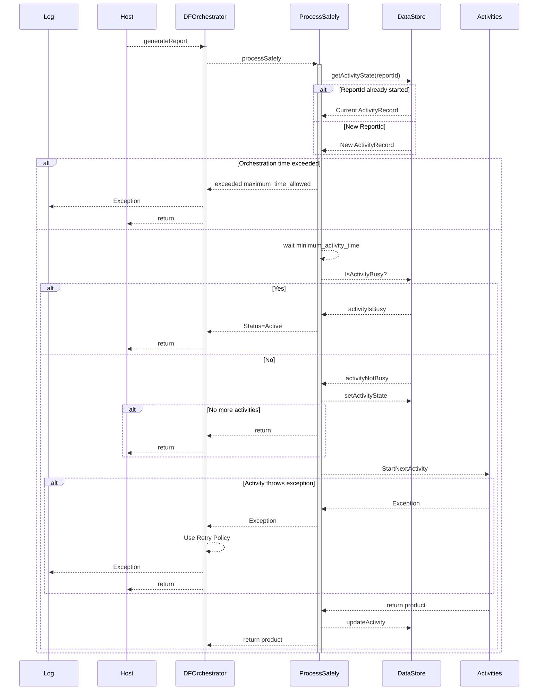

# Durable Template

This is being used to validate flow management beyond that normally used in Durable Functions.

Specifically, we want to manage some possible issues with individual Activities automatically:
we want to recognize these states and respond appropriately:
    ActivityState|Meaning|Action
    --|--|--
    Stuck | In an unknown, unresponsive or timed-out state | dispose if possible and try anew
    Deferred| In a resource-depleted environment| wait and try again later
    Active| Busy doing the work| back off and give it time
    Completed| completed successfully| capture results and allow to continue
    Stalled| Had a retriable problem| defer to the durable function retry policy in force
    Failed | Had a fatal problem| throw the exception into the durable function orchestrator and schedule its termination

The shell being developed here should allow us to test a simple sequence of activities in which we can emulate all of these conditions and verify that the Durable Function Orchestrator behaves appropriately in each case.

The initializer for the sequence is a generic object, which is then wrapped in a product carrier for passing between steps.

In order for the system to know that an activity has been started, an external data store is needed. This simply saves the current activity and state for each orchestration each orchestration.

For this we need the simplest of data stores:

ActivityMetadata:
- `Key` a unique orchestration key
- `ActivityName` the Activity Identifier
- `ActivityState` unknown|Stuck|Active|Completed|Stalled|Failed
- `ActivityTime` the start time
- `Sequence` used to track iterations
- `Message` can hold data or diagnostic information

These last three properties are collectively known as an `ActivityRecord`

The information is indexed using the `Key`, so can be implemented simply using a dictionary<string, ActivityRecord> at this stage.

The Product<T> which is serialized and passed from step to step needs to have
- T `Payload` 
- string `Key` the orchestration Id
- string `Activity` the current activity
- int `Iteration` a repeat counter for retries
- int `ProcessId` to verify if still alive
- List<ActivityRecord> `History` a log of all the activities associated with this orchestration.

[Also see this file](./NixNotes.md)

## Data structures

[ref](./init.sql)

rpt.ReportFlowState table

rpt.FlowStates table

## Responsibilities

The **Durable function orchestrator** defines the __sequence__ of activities that is to occur, and implements retry policies for non-fatal errors

The **DataStore** holds the __status__ of each instance of an orchestrator 

The **SafeProcessor** mediates between the activities and the Durable Functions framework based on the Activity State rules

The **Product** wraps the __payload__ and diagnostic and status information

The **Durable Function Activities** process, update and return the Product. The Activities are responsible for catching any exceptions within their realm and determining whether errors are __fatal__ or __retriable__, and communicating that in the ActivityState of the Product.

## DataStore interactions

1. When an orchestration is started for the first time (with that particular key) there will be no record in the FlowManagement table. This needs to be detected and a new record inserted. The content of this record is then returned "read-only" to become part of the Product history.
2. If the record already exists, the record should be returned "read-only" like the above.
3. It is possible and likely that the two cases above can be combined in a single read. `GetState(key)`
4. Based on the state retrieved, the SafeProcessor proceeds differently. Some of the operations require that the record be updated, so the records will be rewritten here. Note there is only ever one record for a given key. `UpdateState(key, data)`
5. When the orchestration completes, it might be feasible to clean up the now-obsolete data, to improve performance. `Cleardata(key)1`

Let's review the data access for the different states ....

. |unknown | Stuck | Deferred | Active | Completed | Stalled | Failed
--|--|--|--|--|--|--
Init|by new key|on timeout|on resource depletion|on activity start|on activity end|on activity end| on activity end
Read|ps start|ps start|ps start|ps start|ps start|ps start|ps start|
Write|initial|time check|resource check|activity start|activity end|activity end|activity end/crash

## The story from the SafeProcessor's viewpoint:

In the beginning, we have a key for a record that does not exist in the database yet.

The orchestrator starts with (at least) this key, and calls ProcessSafely many times until done.

Here ....
1. If the orchestration itself is over the time limits, it could be **Stuck**
2. We delay a while to reduce thrashing
3. We read (or possibly create anew) the latest ActivityRecord
4. Write the activity to the log on the product
5. Assume that the last activity called would have set
   1. **Stalled** if a retriable exception
   2. **Failed** if a fatal exception
   3. **Deferred** if not enough resources just yet
6. Switch on the retrieved state:
   1. Stuck: If the limit for retrying hangs allows, reset the activity to allow restart, otherwise fail
   2. Stalled: throw an exception so that the retry mechanism applies itself
   3. Deferred: this is a resource issue, enter a sleep
   4. Active: it is busy, give it time: just return
   5. Completed: Update the record to the next activity and make it active and launch it
   6. Failed: update logs, throw final exception
7. Return the last product

